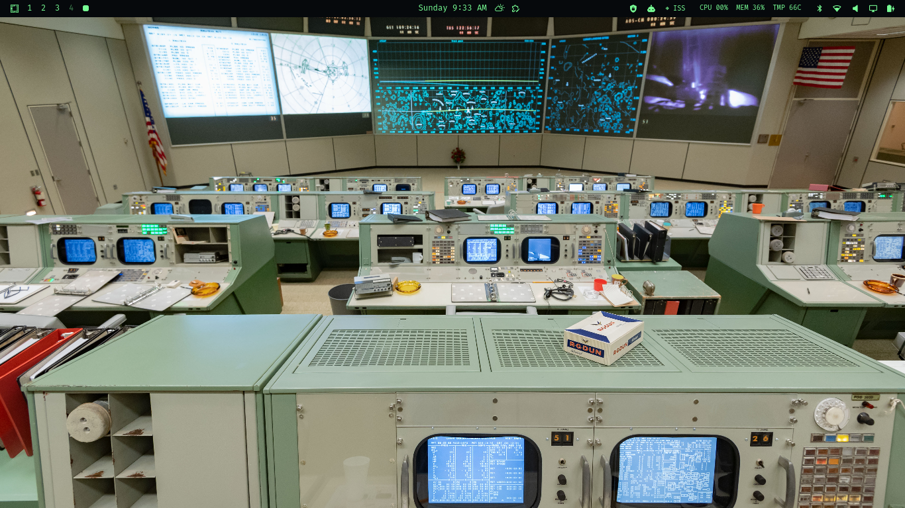
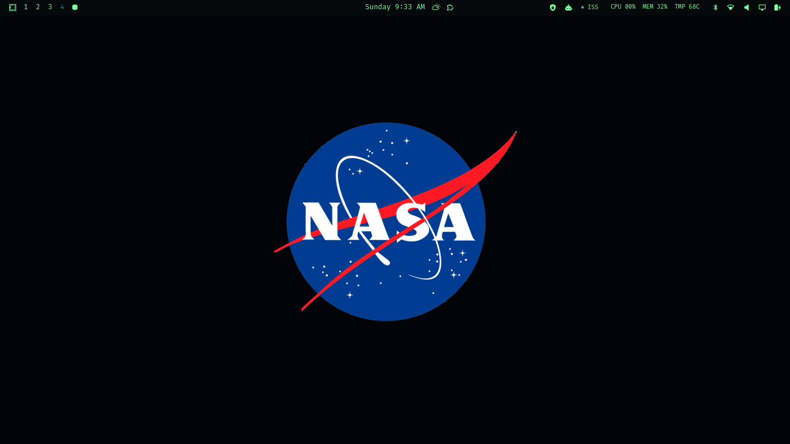
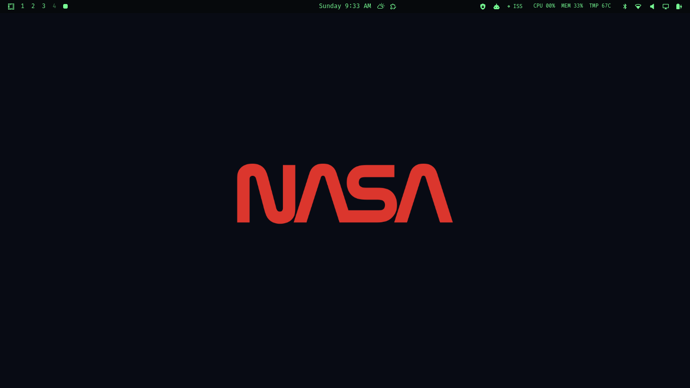
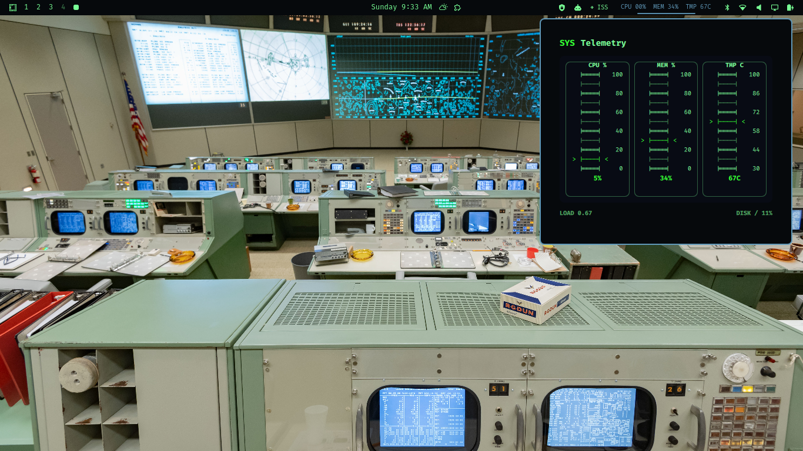

# Space Era

Space Era is an Omarchy theme that turns your desktop into a compact mission-control console: deep black surfaces, phosphor-green telemetry, NASA red alerts, blue tracking overlays, and a real Apollo-era Mission Control wallpaper anchoring the whole thing.

It is not a landing page. It is the cockpit.

## Features

- Space Era Omarchy theme with matched Mission Control palette.
- Opaque black menu bar for a clean instrument-panel feel.
- Apollo-inspired system telemetry plugin with console-style needle gauges.
- Live ISS tracker plugin with:
  - real coastline map data
  - live ISS marker
  - white orbit path
  - blue visibility footprint
  - configurable user city
  - user-location marker
  - next pass countdown and duration
  - flashing `ACQUIRED` bar state when the ISS is in range
- High-resolution NASA Mission Control background.

## Screenshots










## Install

Install the theme directly from GitHub:

```bash
omarchy theme install https://github.com/diogogc/SpaceEraTheme.git
omarchy theme set "Space Era"
```

Then install the bundled console plugins:

```bash
mkdir -p ~/.config/omarchy/plugins
cp -a ~/.config/omarchy/themes/space-era/plugins/spaceera-iss-tracker ~/.config/omarchy/plugins/spaceera.iss-tracker
cp -a ~/.config/omarchy/themes/space-era/plugins/spaceera-telemetry ~/.config/omarchy/plugins/spaceera.telemetry
```

Add the widgets to your Omarchy bar configuration if they are not already present in `~/.config/omarchy/shell.json`:

```json
{
  "bar": {
    "layout": {
      "right": [
        "spaceera.iss-tracker",
        "spaceera.telemetry"
      ]
    }
  }
}
```

Omarchy usually hot-reloads local plugins. If needed, restart the shell:

```bash
omarchy restart shell
```

The plugins use standard command-line tools available on a typical Omarchy system: `bash`, `curl`, `jq`, and `python3`.

## Standalone ISS Tracker

The ISS tracker plugin is also available as its own repository:

```bash
git clone https://github.com/diogogc/spaceera-iss-tracker.git ~/.config/omarchy/plugins/spaceera.iss-tracker
```

## ISS Tracker Usage

Click `ISS` in the bar to open the tracker panel.

- Type a city in the `HOME` field and press Enter or `SET`.
- Your city is saved in `~/.config/spaceera/iss-location.json`.
- The map shows your location, the ISS location, orbit path, and visibility footprint.
- When the ISS is inside your visibility footprint, the bar flashes and shows `ACQUIRED`.

Right-click the bar widget to refresh live data.

## Telemetry Usage

Click `Telemetry` in the bar to open the system panel. The panel shows CPU, memory, and temperature as character-based Apollo-style gauges.

Right-click the bar widget to refresh immediately.

## Credits

Created by **diogo carvalho**.

The Mission Control background is based on official NASA imagery. Space Era's theme styling, plugin design, and console instrumentation are original work by diogo carvalho.

## License

Released under the **Creative Commons Attribution 4.0 International License (CC BY 4.0)**. You may use, modify, and share it, but you must give appropriate credit to **diogo carvalho**.
