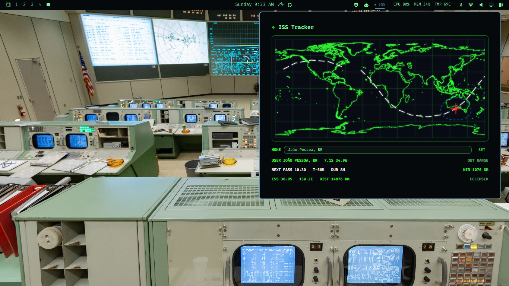

# Space Era ISS Tracker

Space Era ISS Tracker is a live Omarchy bar plugin that feels like a tiny mission-control instrument. It plots the International Space Station on a console-style world map, draws the current orbit, shows your city, predicts the next pass, and flashes `ACQUIRED` when the station enters your visibility footprint.

It is orbital telemetry with a little drama.

## Features

- Live ISS latitude, longitude, altitude, and velocity.
- Real coastline map data rendered in terminal-inspired style.
- Red ISS indicator.
- White orbit path.
- Blue visibility circle.
- Configurable home city with saved location.
- User-location marker on the map.
- Next pass prediction with countdown, duration, and closest approach.
- Flashing/inverting bar state with `ACQUIRED` when the ISS is in range.
- Right-click refresh from the bar.

## Screenshot



## Install

Install and enable it directly from GitHub:

```bash
omarchy plugin add https://github.com/diogogc/spaceera-iss-tracker.git --enable
```

If you prefer a manual setup, clone it into your Omarchy plugins directory and use the manifest id `spaceera.iss-tracker` in your bar layout.

Add the widget to your Omarchy bar configuration if it is not added automatically:

```json
{
  "bar": {
    "layout": {
      "right": [
        "spaceera.iss-tracker"
      ]
    }
  }
}
```

Omarchy validates the plugin before installing it. If needed, restart the shell:

```bash
omarchy restart shell
```

## Remove

Disable and remove the plugin with Omarchy:

```bash
omarchy plugin remove spaceera.iss-tracker
```

To delete the saved home city as well:

```bash
rm -f ~/.config/spaceera/iss-location.json
```

## Usage

Click `ISS` in the bar to open the tracker panel.

- Enter a city in the `HOME` field and press Enter or `SET`.
- The plugin stores your configured city in `~/.config/spaceera/iss-location.json`.
- The map shows the ISS, orbit line, visibility footprint, and your home marker.
- When the ISS is inside your visibility footprint, the bar flashes and shows `ACQUIRED`.

Right-click the bar widget to refresh live data.

## Requirements

- Omarchy shell / Quickshell.
- `bash`, `curl`, `jq`, and `python3`.
- Network access for live ISS position data from `api.wheretheiss.at` and city geocoding from `geocoding-api.open-meteo.com`.
- Writes only its own saved city file at `~/.config/spaceera/iss-location.json` and runtime cache under `XDG_RUNTIME_DIR` or `/tmp`.

## Credits

Created by **diogo carvalho**.

The console visual direction, Omarchy plugin implementation, and Space Era styling are original work by diogo carvalho.

## License

Released under the **Creative Commons Attribution 4.0 International License (CC BY 4.0)**. You may use, modify, and share it, but you must give appropriate credit to **diogo carvalho**.
